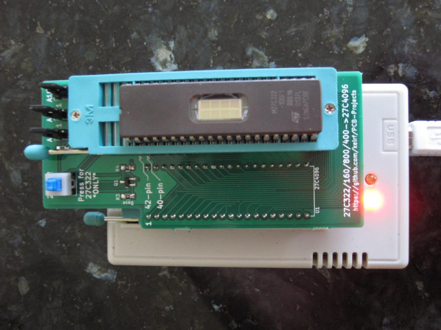
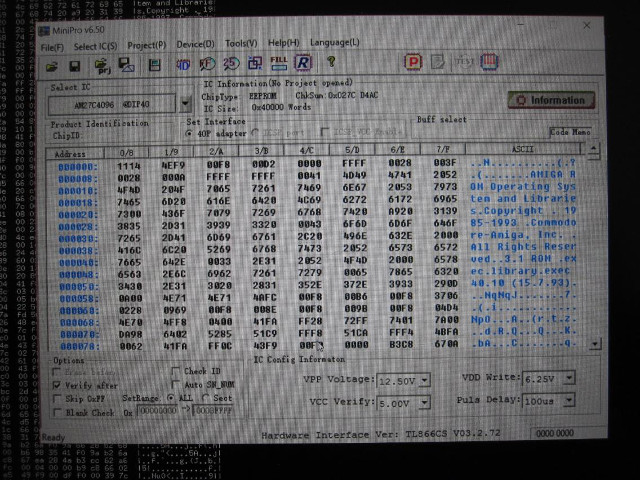
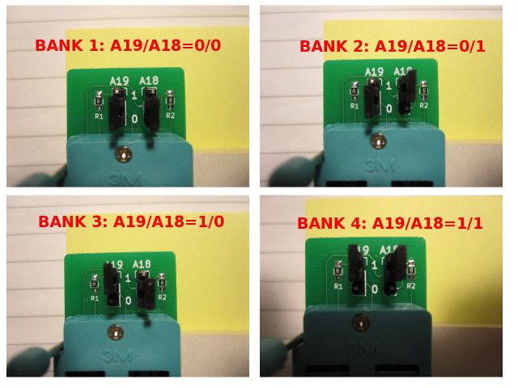

# 27C322/160/800/400 EPROM Programming Adapter Series

## Introduction

This document covers three generations of adapter:
- **1st gen:** 27C400 only. No configuration jumpers.
- **2nd gen:** 27C400/800/160. Two jumpers (A18-A19)
- **3rd gen:** 27C400/800/160/322, Three jumpers (A18-A20), '322-mode switch.

The supported EPROM parts are:
- **27C400:** 40-pin, 4Mbit (256k x 16-bit, 512k x 8-bit)
- **27C800:** 42-pin, 8Mbit (512k x 16-bit, 1M x 8-bit)
- **27C160:** 42-pin, 16Mbit (1M x 16-bit, 2M x 8-bit)
- **27C322:** 42-pin, 32Mbit (2M x 16-bit, no 8-bit access mode)

The adapter converts the pin-outs of the above parts (which is similar
to contemporary DIP-packaged mask ROMs) to 27C4096 pin-out as
supported by the readily-available and cheap TL866 series of USB
programmers.

## Usage

Insert the programming adapter into the TL866 with the socket
handles adjacent to each other. Insert the EPROM into the
lowest-possible position in the adapter and with pin 1 nearest the
handle.

If your adapter has a 27C322-mode push switch, press it **always and
only** when programming 27C322 parts.

In MiniPro software, select `AMD 27C4096 DIP40` device, deselect
`Check ID`, and (typically) set `VPP Voltage 12.50V`.

The EPROM can now be accessed as if it were a 27C4096 device, 512kB at
a time, as configured by the bank-switching handled jumpers:
- **27C400:** no need to set jumpers, program all 512kB in one pass.
- **27C800:** program in 2 512kB passes: A18=0 (bank 1), then A18=1 (bank 2)
- **27C160:** program in 4 512kB passes: A19/A18=00,01,10,11 (banks 1,2,3,4)
- **27C322:** program in 8 512kB passes: A20/A19/A18=000,001,010,011,100,101,110,111 (banks 1,2,3,4,5,6,7,8)

