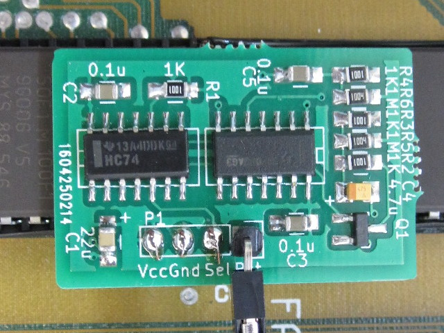
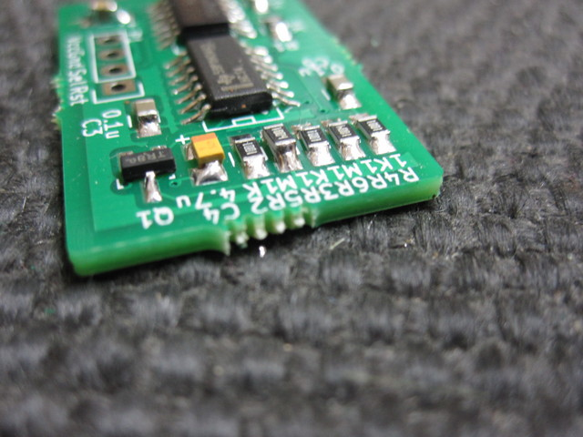
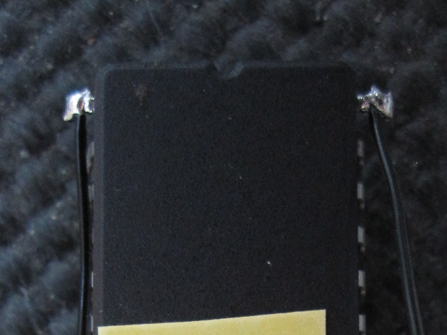
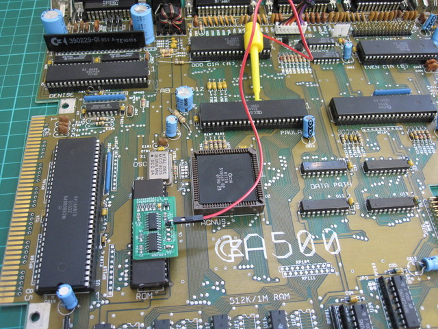
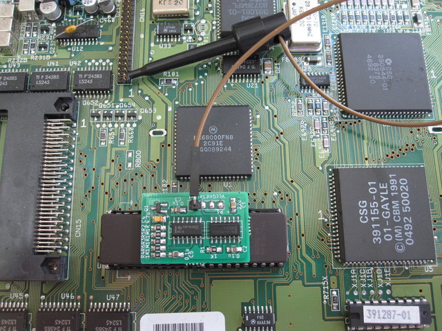
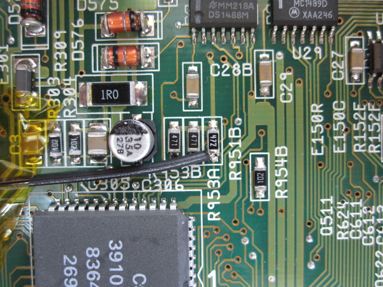
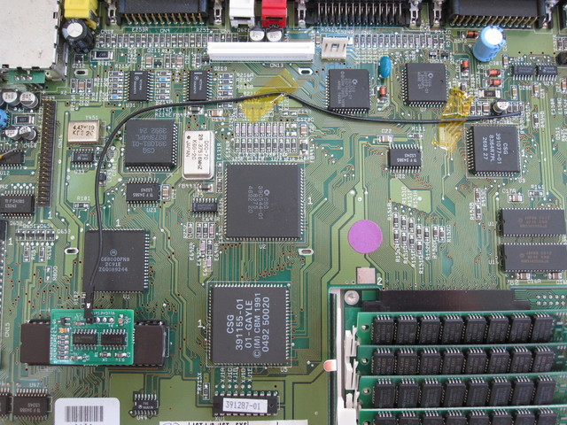

# Piggybacked Kickstart Switcher, v1.0

Keir Fraser, 15th May 2016

## How to use this guide

If you have received this switcher in kit form then please read these
instructions from start to finish. If you have received this switcher
fully assembled then you can skip to the last section ("Installing the
ROM").


## Theory of operation

A ROM is an array of storage locations indexed by a binary-encoded
address at the address pins of the chip. The standard 512kB Amiga ROM
is 256k x 16-bit words, addressed by pins A0-A17. Larger ROMs require
an extra address pin for each doubling of capacity: A18 (1MB), A19
(2MB), and so on.

These larger ROMs can be considered a banked (or multi-ROM-image)
version of the 512kB ROM: A0-A17 address the currently selected 512kB
bank (aka ROM image), while A18+ select between 2 or more banks.

The purpose of the Kickstart switcher, then, is to control the
bank-selection pin(s). Since this design switches between 2 ROM
images, it controls just one address pin (A18) via its output (called
'Sel'). A0-A17 remain under control of the Amiga hardware. A19+, if
present, can be tied to a fixed value.

The switcher defaults to Sel=0 at startup. The output is toggled by
seeing a low pulse at its input (called 'Rst') which is longer than
around 4 seconds. The input is expected to be attached to the
active-low reset line of the Amiga, so that holding Ctrl-Amiga-Amiga
for multiple seconds will trigger the Kickstart switch.


## Building the switcher

For each self-build kit, the following parts are supplied (package
type in brackets where applicable):
- 1 x PCB
- 1 x 74HC14 (SOIC-14)
- 1 x 74HC74 (SOIC-14)
- 4 x 1K resistor (0805) [marked '1001']
- 3 x 1M resistor (0805) [marked '1004']
- 3 x 0.1uF MLCC (0805) [thin brown chip]
- 1 x 22uF MLCC (0805) [thick brown chip]
- 1 x 4.7uF tantalum (2012) [yellow with anode marking]
- 1 x N MOSFET (SOT23)
- 1 x right-angled pcb header pin

See the closeup picture for a build guide. Take care
with the orientation of parts: the SOICs have a bevelled edge on the
side with pin 1; the tantalum capacitor has a bar marking the anode
(+).



In location R5 the 1M resistor gives a reset-to-switch delay of 4
seconds. A second 1M resistor is provided which can be stacked on the
first to halve the delay to 2 seconds.



Soldering advice:

1. Use flux (flux pens can be picked up cheaply from China on
Ebay). Flux pads before applying solder to help it flow and avoid
blobby joints. This is particularly useful for fine solder.

2. Use fine solder, around 0.4mm works well. If your solder is too
thick it is easy to over-apply and end up with blobby joints.

3. Use a regulated soldering station, set it to about 350C, and use a
conical tip (but not too fine) or a small chisel tip (say up to
2mm). The tip wants to be big enough to get heat to the part but not
too cumbersome for the detailed work. If using a conical tip apply it
at an angle to increase surface area.

4. The 0805 passive components tend to move around while soldering. To
avoid this, apply solder to one pad. Now hold the component in place
with tweezers and re-heat the pad. This will tack the component in
place. Now solder the second pad as usual, and return to the first pad
and add extra solder as required.

5. If you end up with a messy joint, apply more flux and re-heat. The
solder should reflow and make a nicer joint. If there is still to much
solder, remove some with solder wick.

6. Use flux. :)


## Programming the EPROM

This step requires a blank 27C800 or 27C160. Also typically you will
use a TL866 programmer and the 27C160 adapter which I build and
sell. You require 512kB ROM images which are 'byte-swapped' (bytes in
each 16-bit word are swapped). If this is done correctly then, when
loaded into the MiniPro programming software, the Kickstart copyright
message will appear in the buffer window ungarbled. If it's garbled,
you haven't swapped! If you are using a 256kB image (eg Kickstart 1.3)
then double it up.

In Linux or MacOS terminals, the double-up and byte swap could be done
as follows:
```
 # dd if=kick13.rom of=kick13_swapped.rom conv=swab
 # cat kick13_swapped.rom >kick13_swapped_doubled.rom
 # cat kick13_swapped.rom >>kick13_swapped_doubled.rom
```
On Windows you will have to find your own way!

Plug my adapter into the TL866 and set the jumpers to
`A19/A18=0/0`. Select device `27C4096`, deselect `Check ID` and set
`VPP Voltage 12.50V` (optional, but seems to work and closer to 27C160
specs). Insert the EPROM into the adapter. Load your default ROM image
and program the EPROM.

Now load your second ROM image, select `A19/A18=0/1` (27C800) or
`A19/A18=1/0` (27C160, for convenience as A19 pin is on
the same side of the EPROM as the adapter's Sel output pin). Program
the EPROM.


## Physically modifying the EPROM

The EPROM must be physically modified to support the Kickstart
switcher, as pictured.


### 27C160 Modifications

1. Lift pins 1 (A18) and 42 (A19). Optionally cut them short
   (but with enough left to solder onto).

2. Flux pins 1, 22, 31, 42.

3. Apply solder to all fluxed pins and then attach a short piece of
hookup wire ('Kynar' wire, or a strand from an ATA 80 ribbon cable is
appropriate here) to each one.

4. Attach the switcher to the top of the EPROM with glue or
double-sided tape with header P1 on the right-hand side.
Pre-programmed EPROMs are supplied with tape already installed.

5. Connect pin 22 (VCC) to P1:Vcc on the switcher.

6. Connect pin 31 (VSS) to P1:Gnd on the switcher.

7. Connect pin 42 (A19) to P1:Sel on the switcher.

8. Connect pin 1 (A18) to pin 12 (VSS). This ties A18=0.

### 27C800 Modifications

1. Lift pins 1 (A18) and 42 (NC). Optionally cut A18 short (but with
   enough left to solder onto). You may cut off pin 42 completely if
   you want to.

2. Flux pins 1, 22, 31.

3. Apply solder to all fluxed pins and then attach a short piece of
hookup wire ('Kynar' wire, or a strand from an ATA 80 ribbon cable is
appropriate here) to each one.

4. Attach the switcher to the top of the EPROM with glue or
double-sided tape with header P1 on the right-hand side.
Pre-programmed EPROMs are supplied with tape already installed.

5. Connect pin 22 (VCC) to P1:Vcc on the switcher.

6. Connect pin 31 (VSS) to P1:Gnd on the switcher.

7. Connect pin 1 (A18) to P1:Sel on the switcher.


## Installing the ROM

The ROM is directly compatible with any single-ROM Amiga with a 42-pin
ROM socket. In this case insert the ROM with its pin 1 in pin 1 of the
socket (however since this pin is lifted, it will of course not make
contact with the socket).

If the Amiga has a 40-pin socket then ensure that pin 31 of the socket
is connected to VCC. This is true for A500 Rev 6 and later, A500 Plus,
and A600, among others. If compatible, insert the ROM with pin 2 in
pin 1 of the socket (ie. the lifted pins overhang the socket).

Now you must attach P1:Rst of the switcher to the Amiga's reset
line. A jumper wire and probe clip are supplied for this purpose
(separately if supplied in kit form; soldered together in assembled
form).

**WARNING:** The ROM will not work reliably until connected to the
reset line. It will switch randomly between the programmed Kickstart
images causing crashes.

### A500 Installation
Clip to the leg of any DIL chip connected to the _RST line. Paula pin
11 is a good choice (see picture). You may
need to bend and/or open up the probe clip a little to hook it around
the chip pin -- make sure to retract the clip as far as possible and
snug the probe up against the pin, and check that the clip does not
touch any adjacent pin.



If you want a more permanent connection, _RST is available at various
vias on the A500 motherboard (eg. there is one near Paula on at least
Rev 6A: see below) or at resistor array RP101. A buzz
test with a multimeter for continuity with Paula pin 11 will confirm
that a via or track carries _RST.


### A2000 Installation
Similar to A500 you can clip to any DIL chip connected to the _RST
line: eg. Paula pin 11, 68000 pin 18, or Gary pin 41.

### A600 Installation
Clip to pin 1 of the IDE port if it is unused.




Otherwise you will need to solder to resistor
R951B near Paula.



