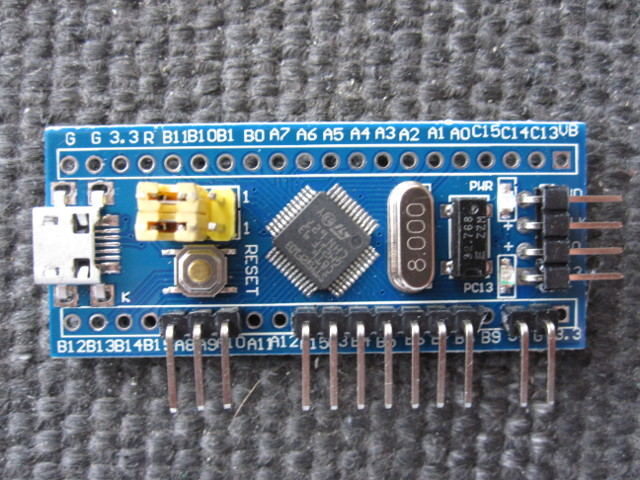
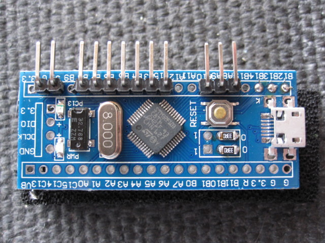
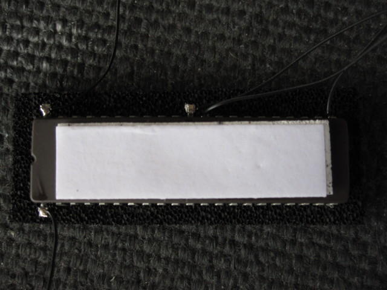

# Building

To build a switcher for A500 or A600 you will need the following parts:
- STM32 "Blue Pill" board 
- USB-TTL serial adapter
- 12-pin 2.54mm-pitch right-angled single-row PCB header
- PC motherboard speaker/buzzer
- Hookup wire (kynar or similar)
- Suitable capacity EPROM: 27C160 (up to 4 images), 27C322 (up to 8 images)

## Preparing the PCB

First cut the PCB header into 2-pin, 3-pin and 7-pin sections. Solder
these along one side of the bare STM32 board as show below. Make sure
the headers are installed straight and even.



Next we program the STM32. You will need a USB-TTL adapter such as
shown below. These are available for around £1 on Ebay.


Now adjust the yellow boot jumpers on the STM32 board and attach the
Dupont jumper cables supplied with the USB-TTL adapter as shown. In
this example the cables connect to the following USB-TTL pins:
White to GND, Black to 5V, Purple to RXD, Blue to TXD.


Download the firmware zip file from [here (Google Drive)](https://drive.google.com/file/d/0B6F45EdkSMp1MV80cnJWRXFXMkk/view). This
contains a number of HEX programming files, one for each possible
number of ROM images (2 through 8). On Linux the firmware can now be
programmed with the stm32flash command-line utility:
```
 # unzip kswitch_v2.zip
 # sudo stm32flash -vw kswitch_v2/kswitch.hex /dev/ttyUSB0
```

Once the device is programmed you can remove the boot and debug
headers. The boot-select pins should be forced to 00 by bridging the
appropriate through holes with wire or low-value chip resistors as
shown.



If fitting to an A500 with its top shield intact you may also wish to
remove the USB socket. The mounting tabs can be snipped with small
side cutters and the socket then gently pulled off.

Finally, you must configure the firmware via the serial line. To do
this, connect to the USB-serial line via a dumb serial terminal at
115200,8n1, and reset the STM32 board. On Linux, for example:
```
 # sudo miniterm.py /dev/ttyUSB0 115200
 > 1
 > <your number of images>
 > 9
```

## Programming the EPROM

This step requires a blank 27C160 or 27C322. Also typically you will
use a TL866 programmer and the 27C160/322 adapter which I build and
sell. You require 512kB ROM images which are 'byte-swapped' (bytes in
each 16-bit word are swapped). If this is done correctly then, when
loaded into the MiniPro programming software, the Kickstart copyright
message will appear in the buffer window ungarbled. If it's garbled,
you haven't swapped! If you are using a 256kB image (eg Kickstart 1.3)
then double it up.

In Linux or MacOS terminals, the double-up and byte swap could be done
as follows:
```
 # dd if=kick13.rom of=kick13_swapped.rom conv=swab
 # cat kick13_swapped.rom >kick13_swapped_doubled.rom
 # cat kick13_swapped.rom >>kick13_swapped_doubled.rom
```
On Windows you will have to find your own way!

Plug my adapter into the TL866 and set the jumpers to
`A20/A19/A18=0/0/0`. Select device `27C4096` and deselect `Check
ID`.Insert the EPROM into the adapter. Load your default ROM image and
program the EPROM.

Now load your second ROM image, select `A20/A19/A18=0/0/1`, and program
the EPROM.

Continue this process for your remaining ROM images, setting the
jumpers in this sequence: `0/1/0`, `0/1/1`, `1/0/0`, `1/0/1`, `1/1/0`,
`1/1/1`,


## Final assembly

The 27C160/27C322 must be physically modified to support the Kickstart
switcher. The below steps are for a 27C322 device. They also apply to 27C160 but ignore references to pin 32 and leave it unmodified!



1. Lift pins 1 (A18), 42 (A19), and 32 (A20, 27C322 only). Cut them short
   (but with enough left to solder onto).

2. Flux pins 1, 22, 31, 32 (27C322 only), and 42.

3. Apply solder to all fluxed pins and then attach a short piece of
hookup wire ('Kynar' wire, or a strand from an ATA 80 ribbon cable is
appropriate here) to each one.

4. Attach the switcher to the top of the EPROM with hot glue or
double-sided foam tape with the angled headers on the right-hand side.
Pre-programmed EPROMs are supplied with tape already installed.

5. Connect pin 22 (VCC) to 5V on the switcher.

6. Connect pin 31 (VSS) to G (GND) on the switcher.

7. Connect pin 1 (A18) to B12 on the switcher.

8. Connect pin 42 (A19) to B13 on the switcher.

9. 27C322 only: Connect pin 32 (A20) to B14 on the switcher.


