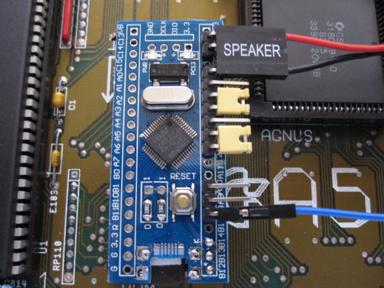
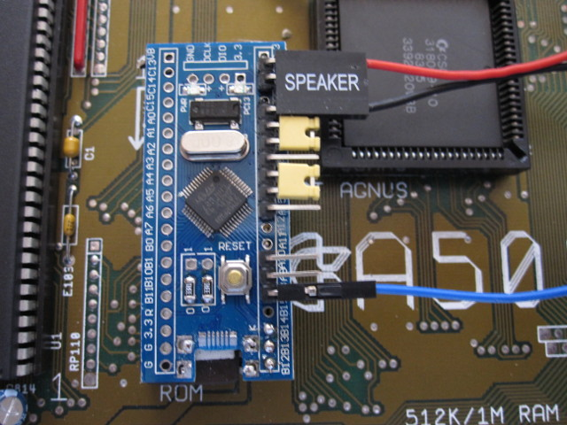
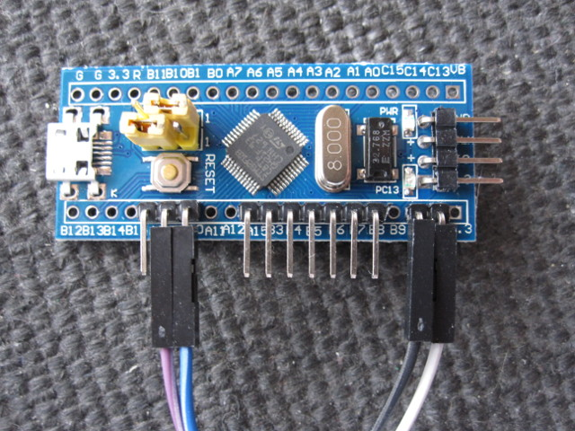

# Advanced configuration

## Jumper configuration

The default 3-second delay to switch ROM image can be reduced to 2
seconds by placing a jumper across pins B3-A15, or increased to 4
seconds by jumpering B3-B4.

The default speaker volume can be decreased by jumpering B5-B6, or
increased by jumpering B6-B7.

Below shows how to set the jumpers to reduce the switching delay and
quieten the speaker.



And this is how to increase the switching delay and the volume.



These are just two examples: Volume and delay settings can be adjusted
independently.

## Serial configuration

The switcher includes a setup menu accessible via serial line. To
access this feature, **first remove the switcher from your Amiga**.

Wire up a USB-TTL serial adapter, such as shown below. These are
available for around £1 on Ebay.


Attach the Dupont jumper cables supplied with the USB-TTL adapter as
shown. In this example the cables connect to the following USB-TTL
pins: White to GND, Black to 5V, Purple to RXD, Blue to TXD.



Connect to the console via a serial terminal at 115200 baud, 8
data bits, no parity, 1 stop bit. On Windows you could
use PuTTY, among many other options. On Linux, you can use Python's
miniterm utility:
```
 # sudo miniterm.py /dev/ttyUSB0 115200
 ```

Install a jumper across B4-B5, and press the switcher reset
button. You will see a welcome text, current configuration, and a
setup menu. From here you can change:
1. The number of images to switch between (2-8)
2. The physical ROM bank assigned to each image slot (banks 0-7)
3. Fine-grained control over reset delay (in 20ths of a second)
4. Fine-grained control over speaker volume

Other options include the ability to save or discard your new
configuration, and to switch to the MCU's built-in bootloader (for
entirely reflashing the switcher firmware).
