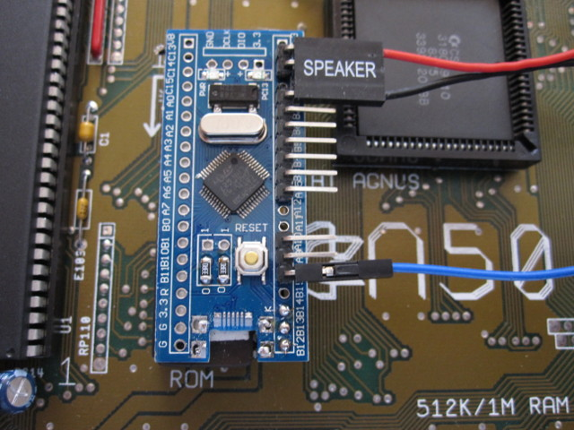
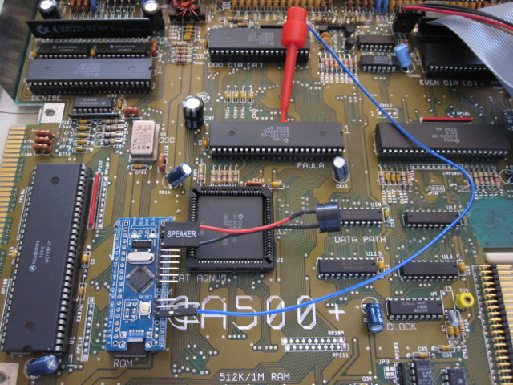
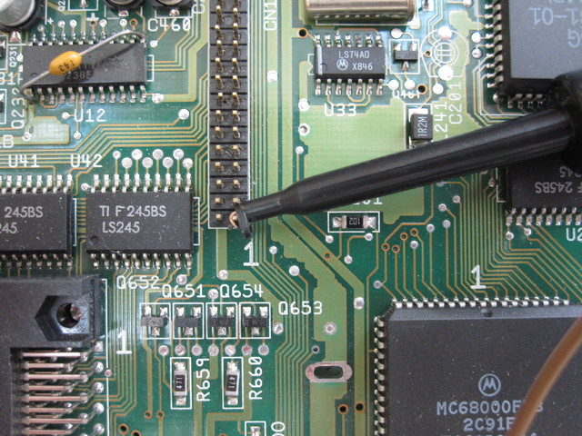

# Installation

The switcher's underlying EPROM must be plugged into your Amiga's
EPROM socket. Pin 1 of the EPROM is at the end marked
`GND/DCLK/DIO/3.3` on the switcher PCB. Be careful when inserting not
to bend any of the EPROM pins.

The ROM is directly compatible with any single-ROM Amiga with a 42-pin
ROM socket. In this case insert the ROM with its pin 1 in pin 1 of the
socket (however since this pin is lifted, it will of course not make
contact with the socket).

If the Amiga has a 40-pin socket then ensure that pin 31 of the socket
is connected to VCC. This is true for A500 Rev 6 and later, A500 Plus,
and A600, among others. If compatible, insert the ROM with pin 2 in
pin 1 of the socket (ie. the lifted pins overhang the socket).

Attach the PC motherboard speaker to pins G and B8 of the
switcher. Attach A18 of the switcher to the Amiga's reset line. A
jumper wire and probe clip are supplied for this purpose (separately
if supplied in kit form; soldered together in assembled form).

**WARNING:** The ROM will not work reliably until connected to the
reset line. It will switch randomly between the programmed Kickstart
images causing crashes.

## A500 Installation
The ROM is installed with the switcher's header pins pointing to the
right (towards the trapdoor).

Clip the reset wire to the leg of any DIL chip connected to the _RST
line. Paula pin 11 is a good choice (see picture). You may need to
bend and/or open up the probe clip a little to hook it around the chip
pin -- make sure to retract the clip as far as possible and snug the
probe up against the pin, and check that the clip does not touch any
adjacent pin.

If you want a more permanent connection, _RST is available at various
vias on the A500 motherboard (eg. there is one near Paula on at least
Rev 6A: see below) or at resistor array RP101. A buzz
test with a multimeter for continuity with Paula pin 11 will confirm
that a via or track carries _RST.

## A2000 Installation
Similar to A500 you can clip to any DIL chip connected to the _RST
line: eg. Paula pin 11, 68000 pin 18, or Gary pin 41.

## A600 Installation
The ROM is installed with the switcher's header pins pointing towards
the rear of the machine.

Clip the reset wire to pin 1 of the IDE port if it is
unused. (NB. following pictures are of an earlier version of the
switcher, however the same principles apply for locating the reset
line).

Otherwise you will need to solder to resistor
R951B near Paula.

